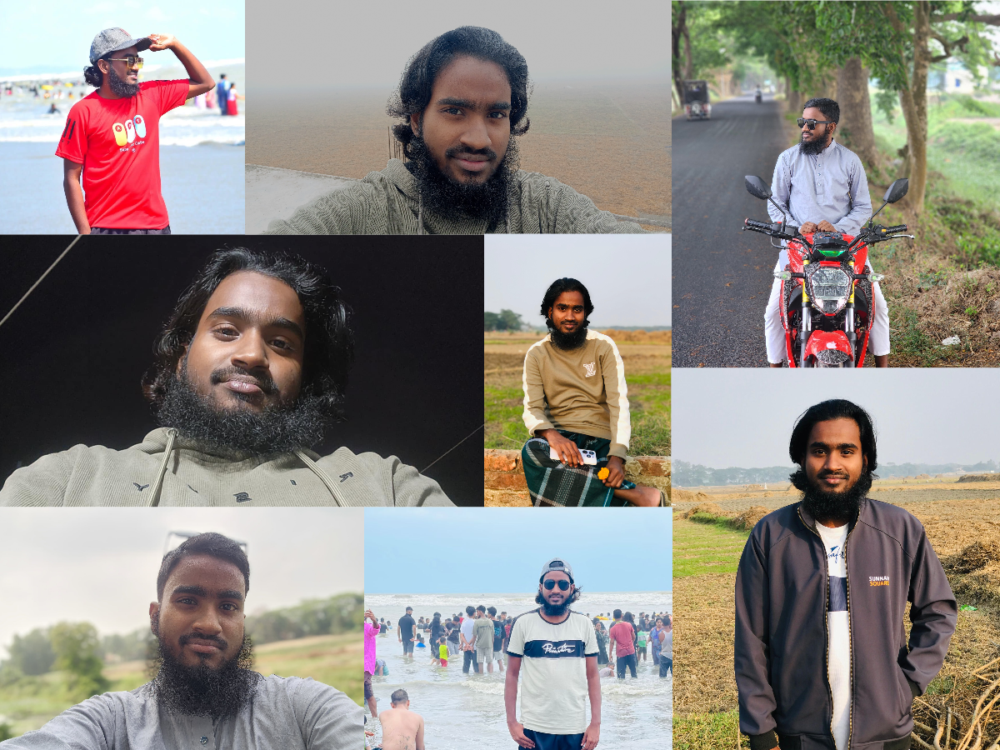

---

<h1 align="center">Hi 👋, I'm Mohammad Raihan Gazi</h1>
<h3 align="center">A passionate Frontend Developer from Dhaka, Bangladesh</h3>

---

### 🧑‍💻 About Me


```js
const raihan = {
  name: "Mohammad Raihan Gazi",
  location: "Dhaka, Bangladesh",
  role: "Fullstack Developer",
  currentlyWorkingOn: ["React.js", "Next.js", "Typescript", "Node.js", "Express.js", "Mongodb"],
  learning: ["Advanced Tanstack", "Redux", "Zustand"],
  lookingToCollaborateOn: ["Open Source Projects"],
  techStack: ["JavaScript", "React", "Next.js", "Typescript", "Express.js", "MongoDB", "Tailwind CSS"],
  funFact: "I love creating web games like Rock Paper Scissors 🤘",
  contact: {
    facebook: "https://www.facebook.com/mohammad.raihan.gazi",
    email: "gazyraihan3@gmail.com"
  }
};
```

---

### 🛠️ Tech Stack


---

### 🧠 Most Used Languages


---

### 📁 Projects

**Coming soon**

---

### 📬 Contact Me

- Facebook: [Mohammad Raihan Gazi](https://www.facebook.com/mohammad.raihan.gazi)
- Email: `gazyraihan3@gmail.com`
- Location: Dhaka, Bangladesh

---

### 📊 GitHub Stats

<p align="center">
  
</p>

---

⭐️ *Thanks for visiting! Feel free to check out my repositories and connect!*
